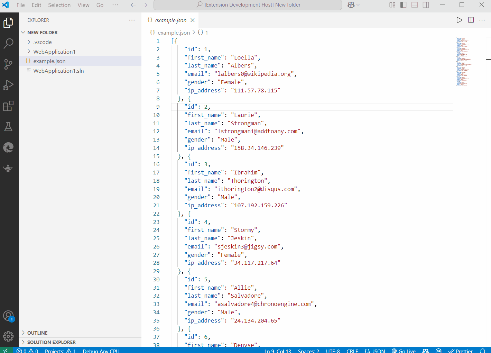

# json-to-sqlite

Convert a JSON file to an SQLite database right from VSCode!

[Install](https://marketplace.visualstudio.com/items?itemName=primaryobjects.json-to-sqlite) in VSCode.



## Quick Start

1. Open your VSCode project.
2. Right-click a JSON file such as `example.json`.
3. Select the context menu **Convert JSON to SQLite**.
4. A new file `example.sqlite` will be saved in the same directory. The database table name is the same as the filename **example**.

To preview an SQLite file contents:

1. Right-click a SQLite file such as `example.sqlite`.
2. Select the context menu **Preview SQLite File**.
3. A message will display showing the top 3 records in the database.

## Settings

To change the name of the table saved in the sqlite file, use the following steps.

1. In VSCode, select **File->Preferences->Settings**.
2. Search for **json-to-sqlite**.
3. Enter a value for **Custom Table Name**.
4. Uncheck the option **Use Filename As Table Name.**

## Features

- Convert any JSON file to SQLite.
- Right-click a JSON file or use the command pallete **Ctrl-Shift-P->Convert JSON to SQLite** and choose a file.
- Preview SQLite file contents.
- Customize the table name stored in sqlite.

## JSON Formats

The following JSON file formats are supported for conversion to SQLite:

### Single Table Format Array

This results in a single table with the name of the JSON file or as configured in settings.

```json
[
  {
    "id": 1,
    "first_name": "Loella",
    "last_name": "Albers",
  },
  {
    "id": 2,
    "first_name": "Laurie",
    "last_name": "Strongman"
  }
]
```

### Named Table Format

This results in a single table with the name "locations".

```json
{
  "locations": [
    {
      "id": 0,
      "name": "Acme Fresh Start Housing",
      "city": "Chicago",
      "state": "IL",
    },
    {
      "id": 1,
      "name": "A113 Transitional Housing",
      "city": "Santa Monica",
      "state": "CA"
    }
  ]
}
```

### Multiple Named Table Format

This results in two tables with the names "table1" and "table2".

```json
[
  {
    "table1": [
      {
        "id": 0,
        "name": "Acme Fresh Start Housing",
        "city": "Chicago",
        "state": "IL",
      },
      {
        "id": 1,
        "name": "A113 Transitional Housing",
        "city": "Santa Monica",
        "state": "CA",
      }
    ]
  },
  {
    "table2": [
      {
        "id": 0,
        "name": "Acme Fresh Start Housing",
        "city": "Chicago",
        "state": "IL",
      },
      {
        "id": 1,
        "name": "A113 Transitional Housing",
        "city": "Santa Monica",
        "state": "CA",
      }
    ]
  }
]
```

## License

MIT

## Author

Kory Becker http://www.primaryobjects.com/kory-becker
